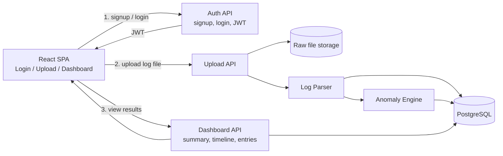

# LogInsight

A full-stack SOC log analysis tool. Users log in, upload a Zscaler-style web proxy log file, and get a human-consumable breakdown of the traffic — summary stats, a timeline of events, and (bonus) rule-based anomaly detection with explanations and confidence scores.

## Architecture

**Flow in words:** the analyst logs in (JWT issued by the auth API), uploads a log file (raw copy saved to disk, contents parsed into structured rows in Postgres), a rule-based engine scans those rows for anomalies, and the dashboard API serves summary/timeline/table/anomaly data back to the UI.

## Tech Stack

- **Frontend:** React + TypeScript + Vite (SPA)
- **Backend:** Node.js + Express + TypeScript (REST API)
- **Database:** PostgreSQL
- **Auth:** email/password signup+login, bcrypt-hashed passwords, JWT sessions
- **Anomaly detection:** rule-based/statistical (deterministic, explainable — see below)
- **Deployment (local):** Docker Compose

## Task Breakdown

Built step by step; each step lands as its own commit with a passing test before moving on.

### Phase 1 — Basic implementation
- [x] Repo scaffold: `backend/` (Express+TS) and `frontend/` (Vite+React+TS) skeletons, `docker-compose.yml`, Postgres service
- [x] Database schema (`users`, `uploads`, `log_entries`, `anomalies`) + migration/init script
- [x] Backend auth: signup, login, JWT issue/verify middleware + tests
- [x] Backend: file upload endpoint (raw file to disk/volume) + tests
- [x] Backend: Zscaler log parser (line → structured row) + tests
- [x] Backend: ingest service (parse file → bulk insert `log_entries`) + tests
- [x] Backend: summary/timeline/entries read endpoints + tests
- [x] Frontend: auth pages (login/signup) + auth context wired to backend
- [ ] Frontend: upload page
- [ ] Frontend: dashboard — summary cards, timeline chart, paginated log table
- [ ] End-to-end check: sign up, log in, upload a sample file, see it on the dashboard

### Phase 2 — Bonus: anomaly detection
- [ ] Anomaly engine: rate-spike-per-IP rule + test
- [ ] Anomaly engine: blocked/malware-category rule + test
- [ ] Anomaly engine: off-hours + large-transfer rule + test
- [ ] Anomaly engine: rare domain/category rule + test
- [ ] Wire anomaly engine into ingest pipeline, persist to `anomalies` table
- [ ] Frontend: highlight anomalous rows in the log table, show explanation + confidence score

### Phase 3 — Polish & deliverables
- [ ] Sample log generator + committed example log files (normal + with-anomalies)
- [ ] README: setup instructions, AI-usage explanation, API reference (this file, filled in as we go)
- [ ] Responsive/basic styling pass
- [ ] (Optional/bonus) live deployment

## AI Usage

_To be filled in as the anomaly detection and any AI-assisted tooling is implemented._

## Local Setup

_To be filled in once the Docker Compose stack is complete._

## Sample Log Files

_See `sample-logs/` (added in Phase 3)._
