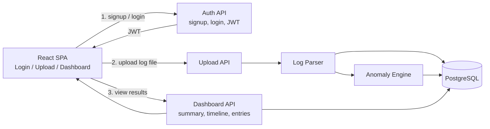
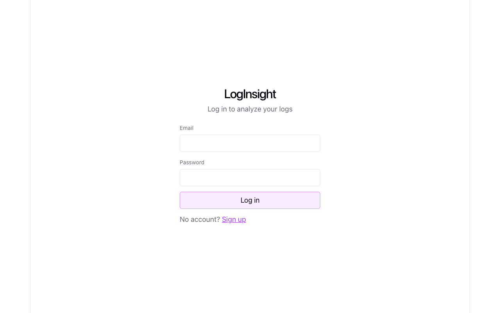
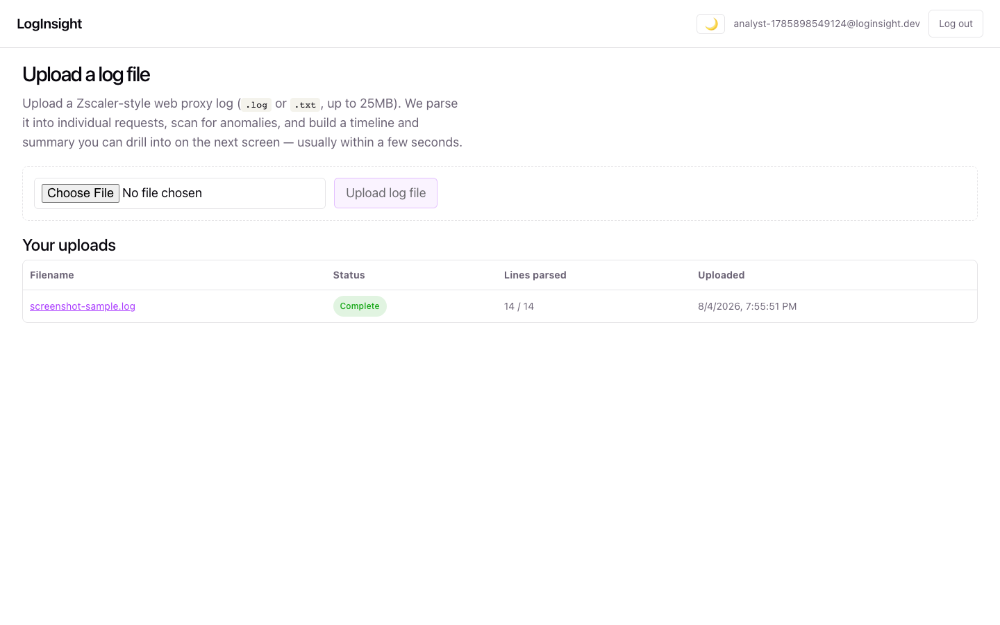
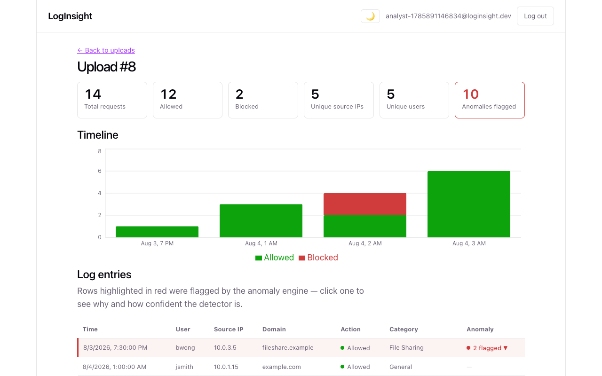
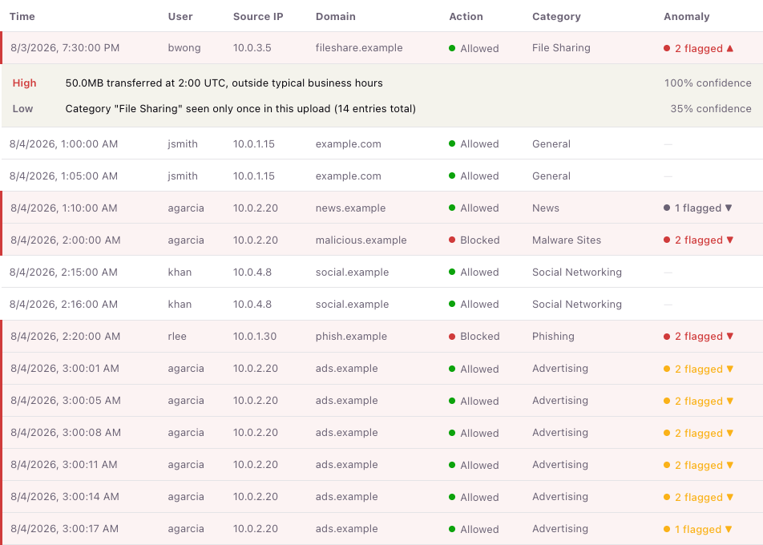
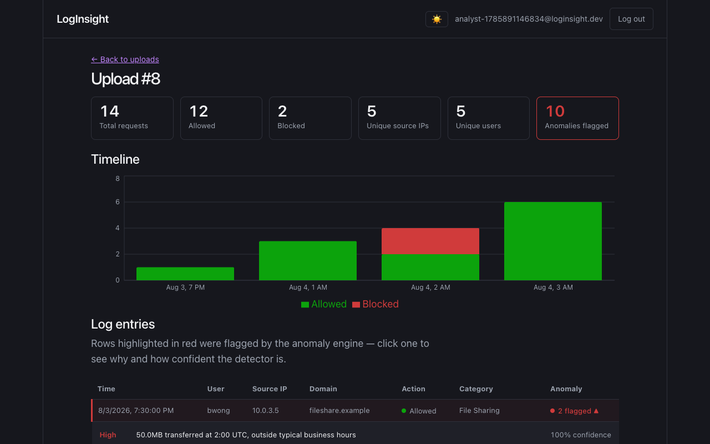

# LogInsight

A full-stack SOC log analysis tool. Users log in, upload a Zscaler-style web proxy log file, and get a human-consumable breakdown of the traffic — summary stats, a timeline of events, and (bonus) rule-based anomaly detection with explanations and confidence scores.

## Architecture



**Flow in words:** the analyst logs in (JWT issued by the auth API), uploads a log file (parsed in-memory into structured rows in Postgres — the raw file itself isn't persisted, see [Limitations](#limitations)), a rule-based engine scans those rows for anomalies, and the dashboard API serves summary/timeline/table/anomaly data back to the UI.

## Screenshots

| Login | Upload |
|---|---|
|  |  |

**Dashboard** — summary cards, timeline chart, and log table (light mode):


**Anomaly detail** — clicking a flagged row expands its rule, description, and confidence score. This example shows all four detection rules firing in one upload: a large off-hours transfer, a rarely-seen category, a request-rate burst from one IP, and a blocked/malware hit:


**Dark mode** (manual toggle, top-right of the header):


## Tech Stack

- **Frontend:** React + TypeScript + Vite (SPA)
- **Backend:** Node.js + Express + TypeScript (REST API)
- **Database:** PostgreSQL
- **Auth:** email/password signup+login, bcrypt-hashed passwords, JWT sessions
- **Anomaly detection:** rule-based/statistical (deterministic, explainable — see below)
- **Deployment (local):** Docker Compose

## Task Breakdown

Built step by step; each step lands as its own commit with a passing test before moving on.

### Phase 1 — Basic implementation
- [x] Repo scaffold: `backend/` (Express+TS) and `frontend/` (Vite+React+TS) skeletons, `docker-compose.yml`, Postgres service
- [x] Database schema (`users`, `uploads`, `log_entries`, `anomalies`) + migration/init script
- [x] Backend auth: signup, login, JWT issue/verify middleware + tests
- [x] Backend: file upload endpoint (raw file to disk/volume) + tests
- [x] Backend: Zscaler log parser (line → structured row) + tests
- [x] Backend: ingest service (parse file → bulk insert `log_entries`) + tests
- [x] Backend: summary/timeline/entries read endpoints + tests
- [x] Frontend: auth pages (login/signup) + auth context wired to backend
- [x] Frontend: upload page
- [x] Frontend: dashboard — summary cards, timeline chart, paginated log table
- [x] End-to-end check: sign up, log in, upload a sample file, see it on the dashboard

### Phase 2 — Bonus: anomaly detection
- [x] Anomaly engine: rate-spike-per-IP rule + test
- [x] Anomaly engine: blocked/malware-category rule + test
- [x] Anomaly engine: off-hours + large-transfer rule + test
- [x] Anomaly engine: rare domain/category rule + test
- [x] Wire anomaly engine into ingest pipeline, persist to `anomalies` table
- [x] Frontend: highlight anomalous rows in the log table, show explanation + confidence score

### Phase 3 — Polish & deliverables
- [x] Sample log generator + committed example log files (normal + with-anomalies)
- [x] README: setup instructions, AI-usage explanation, API reference (this file, filled in as we go)
- [x] Responsive/basic styling pass
- [ ] (Optional/bonus) live deployment

## AI Usage

**In the running application — no LLM at runtime.** The anomaly detection feature is deliberately **rule-based and statistical**, not LLM-based:

- `detectRateSpikes` — sliding-window burst detection per source IP
- `detectBlockedOrMalware` — flags proxy-blocked and malware-category hits
- `detectOffHoursLargeTransfer` — large transfers outside business hours
- `detectRareCategories` — suspicious categories, and categories seen only once in the upload

(all in [`backend/src/services/anomalyEngine.ts`](backend/src/services/anomalyEngine.ts))

Each rule is a small pure function you can read top to bottom, with a fixed, documented confidence formula. **Why not an LLM for detection:** a SOC tool needs anomaly flags that are reproducible (the same file always produces the same flags), auditable (a reviewer can see exactly why a threshold tripped), fast (runs synchronously during ingest, no API round-trip), and free of an external API dependency/cost per upload. A natural next step, if this went further, would be using an LLM only to turn an already-detected anomaly into a richer natural-language write-up for the analyst — detection would stay rule-based, and the LLM would be a presentation layer on top, not the decision-maker.

**How AI was used to build this project:** the application code, tests, and this README were built with Claude Code (Anthropic's CLI coding agent) as a pair-programming tool, working step by step from the take-home brief through an interactive session — architecture decisions, code, and copy were reviewed and directed throughout rather than generated unattended.

## Local Setup

### Option A — Docker Compose (recommended)

Requires Docker Desktop (or another Docker Engine + Compose v2).

```bash
git clone https://github.com/AkashRupapara/LogInsight.git
cd LogInsight
docker compose up --build
```

This starts three services:
- **postgres** (`localhost:5432`) — schema in [`backend/db/init.sql`](backend/db/init.sql) is applied automatically on first boot
- **backend** (`localhost:4000`) — Express API
- **frontend** (`localhost:5173`) — nginx serving the built React app, proxying `/api/*` to the backend

Open **http://localhost:5173**, sign up, and upload a file from `sample-logs/`.

To stop: `docker compose down` (add `-v` to also drop the Postgres volume and start fresh).

### Option B — Run without Docker (two terminals)

Needs Node.js 20+ and a local Postgres instance.

```bash
# 1. Create the database and apply the schema
createdb loginsight
psql loginsight < backend/db/init.sql

# 2. Backend
cd backend
cp .env.example .env   # edit DATABASE_URL/JWT_SECRET if needed
npm install
npm run dev             # http://localhost:4000

# 3. Frontend (separate terminal)
cd frontend
npm install
npm run dev              # http://localhost:5173, proxies /api to :4000
```

### Running the tests

```bash
cd backend
npm test                 # fast unit tests, no DB required

docker compose up -d postgres   # if not already running
npm run test:integration        # full suite incl. DB-backed integration tests

cd ../frontend
npm test
```

## Live Deployment

**Live link:** _to be added — temporary deployment, up only for the duration of evaluation (see [Limitations](#limitations))._

Deployed as two Vercel projects (frontend + backend) sharing a free [Neon](https://neon.tech) Postgres database. Steps to reproduce:

1. **Database (Neon):** create a free project, copy the **pooled** connection string (Connection Details → toggle "Pooled connection" — required for serverless, since each function invocation opens a fresh connection and the direct connection string exhausts Postgres's connection limit quickly), then apply the schema once: `psql "<connection-string>" -f backend/db/init.sql`.
2. **Backend:** on vercel.com, "Add New Project" → import this repo → set **Root Directory** to `backend`. Add env vars `DATABASE_URL` (the pooled string from step 1) and `JWT_SECRET` (any long random value). Deploy — this runs the Express app as a serverless function via [`backend/api/[...path].ts`](<backend/api/[...path].ts>).
3. **Frontend:** edit [`frontend/vercel.json`](frontend/vercel.json)'s rewrite destination to point at the backend project's deployed URL from step 2, then "Add New Project" again with **Root Directory** `frontend` and deploy. The rewrite proxies `/api/*` to the backend so the frontend's existing same-origin `fetch('/api/...')` calls work unchanged, with no CORS configuration needed.
4. Back on the backend project, set `FRONTEND_ORIGIN` to the frontend's URL from step 3 and redeploy.

## API Reference

All routes are prefixed `/api`. Routes marked 🔒 require `Authorization: Bearer <token>`.

| Method | Path | Description |
|---|---|---|
| GET | `/health` | Liveness check |
| POST | `/auth/signup` | Create an account, returns `{ user, token }` |
| POST | `/auth/login` | Returns `{ user, token }` |
| GET | `/auth/me` 🔒 | Current user |
| POST | `/uploads` 🔒 | Multipart upload (`file` field, `.log`/`.txt`, ≤25MB) — parses, runs anomaly detection, returns the upload record |
| GET | `/uploads` 🔒 | List the caller's uploads |
| GET | `/uploads/:id` 🔒 | One upload record |
| GET | `/uploads/:id/summary` 🔒 | Totals, allowed/blocked, unique IPs/users, top categories/IPs, anomaly count |
| GET | `/uploads/:id/timeline` 🔒 | Hourly allowed/blocked counts for the chart |
| GET | `/uploads/:id/entries?limit=&cursor=` 🔒 | Cursor-paginated parsed log rows — returns `{ entries, nextCursor }`; pass `nextCursor` back as `cursor` for the next page, `null` means no more pages |
| GET | `/uploads/:id/anomalies` 🔒 | Flagged anomalies for the upload, with rule, description, confidence, severity |

## Sample Log Files

`sample-logs/` contains a generator and two example files (Zscaler-style CSV, see [`backend/src/services/zscalerParser.ts`](backend/src/services/zscalerParser.ts) for the exact field order):

- **`zscaler_normal.log`** — a day of baseline traffic across 7 synthetic users, no anomalies
- **`zscaler_with_anomalies.log`** — the same baseline plus one deliberately embedded example of each detection rule (a request-rate burst, a blocked malware download, a large off-hours transfer, and a rare/suspicious category hit)

Regenerate them with:

```bash
node sample-logs/generate-sample-logs.js
```

The generator uses a seeded PRNG, so re-running it reproduces the same files.

## Limitations

- **The live deployment is temporary** — it's up only for the duration of evaluation (a couple of weeks) and will be torn down afterward. Everything below still applies to a local Docker Compose run indefinitely.
- **The raw uploaded file isn't persisted anywhere**, on Vercel or locally. It's parsed entirely in memory in the same request it's uploaded in; only the structured rows in `log_entries` (and any resulting `anomalies`) are stored. Nothing in the UI reads the raw file after that point, so this doesn't affect any feature — it only means there's no original copy to go back to.
- **No retry-on-failure.** If ingestion fails partway (a bad DB connection, the process getting killed mid-request), the upload is marked `failed` and the fix today is to re-upload — there's no background job or "retry" affordance built on top of the (now nonexistent) stored file. Per-line parse errors are already handled gracefully and don't trigger this: malformed lines are skipped, not fatal.
